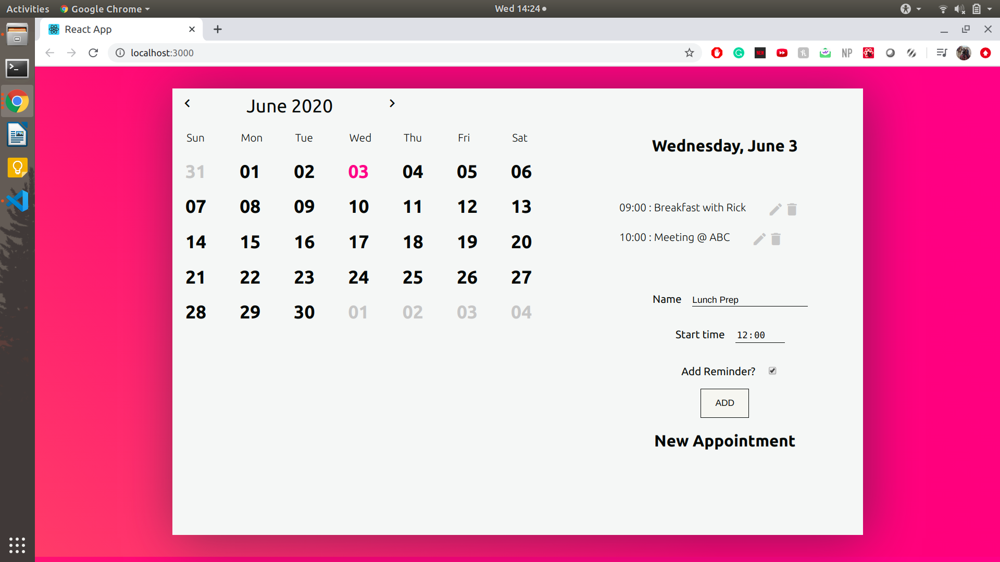

## Installation

In the project directory, you can run:

### `npm i` && `yarn start`

Install all required packages and runs the app in the development mode. 
Open [http://localhost:3000](http://localhost:3000) to view it in the browser.

### Project Specifications
 
The app was built using ReactJS and the 'date-fns' library (built on top of MomentJS). 

#### Components
- Calendar.js : for displaying the calendar and dates according to the month & year
The Month and year can be changed using the chevron arrows

- EventBar.js : for displaying the events of that day stored in the local storage with the option to delete, edit and new appointment.
To add/edit an appointment based on the start time, the form is contained in the app.

## Preview:

